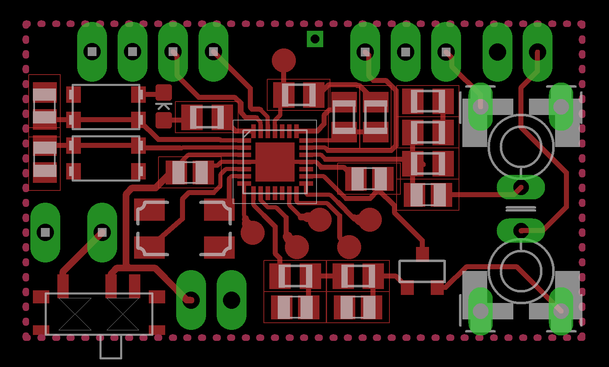

# AVR MFSK (Multi Frequency Shift Keying) modem transceiver

Original project based on ATmega88/168

Goertzel FFT based tone decoding for noisy audio links

Made specifically for radio use

## Features

 - Serial configurable: base frequency, delta frequency and rate (~14 bits per second)

 - Repeated transmission of last data sent for performance testing

 - Audio input clipping indication

 - Automatic PTT control output

 - Automatic valid data checking

 - 8-bit sinewave output for regular audio channels

 - Suitable for keyboard-to-keyboard terminal operation

## Operation

There are two modem modes: normal operation / configuration. They are toggled by pressing the button

Configuring the parameters and enabling repeated transmission is done by going into configuration mode and sending a number corresponding to a byte that each of the it's double bits is a parameter value.

| param name | bit position | 0   | 1   | 2    | 3    |
|------------|--------------|-----|-----|------|------|
| rtrans     | 0            | off | on  | -    | -    |
| base freq  | 2            | 375 | 750 | 1125 | 1500 |
| freq space | 4            | 50  | 100 | 150  | 200  |
| rate*      | 6            | 15  | 25  | 35   | 45   |

*the smaller the value the higher the bit rate

Examples:
```
88 > (01 01 10 00) - rtrans off, bf 2, fs 1, s 1
89 > (01 01 10 01) - rtrans on,  bf 2, fs 1, s 1

152 > (10 01 10 00) - rtrans off, bf 2, fs 1, s 2
```

While in configuration mode the LED shows audio input clipping. To set proper input level, a tone from a modem should be played into the input and the level adjusted to where the LED stops flickering. A solid light means too much signal is being fed.

Transmitting data/message is done by sending it by serial in normal operation mode.
Receiving data/message is only done in normal operation mode and retrieved from serial.

LED stays constantly on while: catching a preamble, receiving data/message and transmitting data/message.

## Hardware




_modem powered on with a battery and connected with a kenwood style cable_


_bare modem_


_modem with a bluetooth module added_


_toner method etched pcbs_


